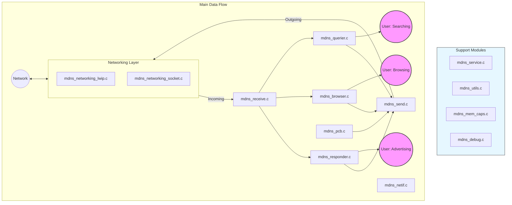

```mermaid
graph TB
    %% Housekeeping modules at the top
    subgraph Housekeeping [Support Modules]
        Service[mdns_service.c]
        Utils[mdns_utils.c]
        MemCaps[mdns_mem_caps.c]
        Debug[mdns_debug.c]
    end

    %% Switch to LR direction for the main flow
    subgraph MainFlow [Main Data Flow]
        direction LR

        %% Network on left side
        Network((Network)) <--> Networking

        %% Networking layer
        subgraph Networking [Networking Layer]
            LWIP[mdns_networking_lwip.c]
            Socket[mdns_networking_socket.c]
        end

        %% Traffic flow
        Networking --> |Incoming| Receive[mdns_receive.c]
        Send[mdns_send.c] --> |Outgoing| Networking

        %% Core MDNS components
        Receive --> Responder[mdns_responder.c]
        Receive --> Browser[mdns_browser.c]
        Receive --> Querier[mdns_querier.c]

        Responder --> Send
        Browser --> Send
        Querier --> Send

        PCB[mdns_pcb.c] --> Send
        NetIF[mdns_netif.c]

        %% Users on the right side, aligned vertically
        Responder --> Advertise((User: Advertising))
        Querier --> Search((User: Searching))
        Browser --> Browse((User: Browsing))
    end

    %% Style user nodes
    style Advertise fill:#f9f,stroke:#333,stroke-width:2px
    style Search fill:#f9f,stroke:#333,stroke-width:2px
    style Browse fill:#f9f,stroke:#333,stroke-width:2px
    style Housekeeping fill:#e6f7ff,stroke:#333,stroke-width:1px
```
