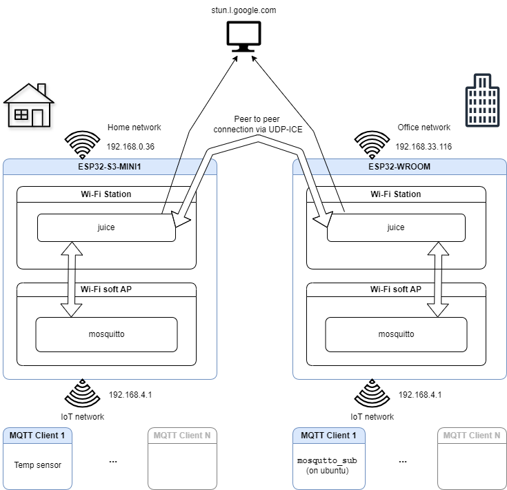

# Brokerless MQTT Example

MQTT served by (two) mosquitto's running on two ESP chips.

* Leverages MQTT connectivity between two private networks without cloud premisses.
* Creates two local MQTT servers (on ESP32x's) which are being synchronized over peer to peer connection (established via ICE/WebRTC protocol)

## Peer to peer connection

Could be established either by [libjuice](https://github.com/paullouisageneau/libjuice) or [esp-webRTC](https://github.com/espressif/esp-webrtc-solution). While `juice` is just a low level implementation of ICE-UDP, we need to provide some signalling and synchronization, the `WebRTC` is full-fledged solution to establish a peer connection using standardized signalling, security and transfer protocols.


## How it works

This example needs two ESP32 chipsets, that will create two separate Wi-Fi networks (IoT networks) used for IoT devices.
Each IoT network is served by an MQTT server (using mosquitto component).
This example will also synchronize these two MQTT brokers, as if there was only one IoT network with one broker.
This example creates a peer to peer connection between two chipsets to keep them synchronize. This connection utilizes libjuice (which implements a simplified ICE-UDP) or esp-webRTC (which implements WebRTC) to traverse NATs, which enabling direct connection between two private networks behind NATs.

* Diagram



Here's a step-by-step procedure of establishing this remote connection:
1) Initialize and start Wi-Fi AP (for IoT networks) and Wi-Fi station (for internet connection)
2) Start mosquitto broker on IoT network
3) Start peer to peer connection
  - In case of `libjuice`
      - gather connection candidates
      - synchronize using a public MQTT broker and exchange ICE descriptors
      - establish ICE UDP connection between the two ESP32 chipsets
  - In case of `webRTC` simply start the connection.
6) Start forwarding mqtt messages
   - Each remote datagram (received from ICE-UDP channel) is re-published to the local MQTT server
   - Each local MQTT message (received from mosquitto on_message callback) is sent in a peer message


## How to use this example

You need two ESP32 devices that support Wi-Fi station and Wi-Fi software access point.

* Configure Wi-Fi credentials for both devices on both interfaces
  * These devices would be deployed in distinct Wi-Fi environments, so the Wi-Fi station credentials would likely be different.
  * They also create their own IoT network (on the soft-AP interface) Wi-Fi, so the AP credentials would likely be the same, suggesting the IoT networks will be keep synchronized (even though these are two distict Wi-Fi networks).
* Choose the peer library
* Only for `libjuice`:
  - Choose `CONFIG_EXAMPLE_SERVERLESS_ROLE_PEER1` for one device and `CONFIG_EXAMPLE_SERVERLESS_ROLE_PEER2` for another. It's not important which device is PEER1, since the code is symmetric, but these two devices need to have different role.
* Optionally: You can use `idf.py` `-D` and `-B` flag to keep separate build directories and sdkconfigs for these two roles
```
idf.py -B build1 -DSDKCONFIG=build1/sdkconfig menuconfig build flash monitor
```
* Flash and run the two devices and wait for them to connect and synchronize.
* Now you can test MQTT connectivity, for example:
  * Join PEER1 device's AP and connect to the MQTT broker with one or more clients, subscribing to one or more topics.
  * Join PEER2 device's AP and connect to the MQTT broker with one or more clients, subscribing to one or more topics.
  * Whenever you publish to a topic, all subscribed clients should receive the message, no matter which Wi-Fi network they're connected to.

## Example output

## With libjuice

```
I (4746) esp_netif_handlers: sta ip: 192.168.0.40, mask: 255.255.255.0, gw: 192.168.0.1
4: mosquitto version v2.0.20~3 starting
4: Using default config.
4: Opening ipv4 listen socket on port 1883.
4: mosquitto version v2.0.20~3 running
I (4756) serverless_mqtt1: desc: a=ice-ufrag:sGdl
a=ice-pwd:R4IPGsFctITbT1dCZbfQTL
a=ice-options:ice2,trickle

00:00:04 INFO    agent.c:1100: Changing state to gathering
I (4776) serverless_mqtt1: JUICE state change: gathering
00:00:04 INFO    agent.c:1100: Changing state to connecting
I (4786) serverless_mqtt1: JUICE state change: connecting
00:00:04 INFO    agent.c:422: Using STUN server stun.l.google.com:19302
00:00:04 INFO    agent.c:1378: STUN server binding successful
00:00:04 INFO    agent.c:1397: Got STUN mapped address 185.194.44.31:62703 from server
00:00:04 INFO    agent.c:2428: Candidate gathering done
I (5066) serverless_mqtt1: Gathering done
I (5066) serverless_mqtt1: desc: {
        "desc": "a=ice-ufrag:sGdl\r\na=ice-pwd:R4IPGsFctITbT1dCZbfQTL\r\na=ice-options:ice2,trickle\r\n",
        "cand0":        "a=candidate:1 1 UDP 2122317823 192.168.0.40 62703 typ host",
        "cand1":        "a=candidate:2 1 UDP 1686109951 185.194.44.31 62703 typ srflx raddr 0.0.0.0 rport 0"
}
I (5096) serverless_mqtt1: Other event id:7
```

### With esp-peer

```
I (5992) esp_netif_handlers: sta ip: 192.168.0.42, mask: 255.255.255.0, gw: 192.168.0.1
4: mosquitto version v2.0.20~3 starting
4: Using default config.
4: Opening ipv4 listen socket on port 1883.
4: mosquitto version v2.0.20~3 running
I (6702) esp-x509-crt-bundle: Certificate validated
I (7982) APPRTC_SIG: result SUCCESS
Initials set to 1
I (7982) HTTPS_CLIENT: HTTP POST Status = 200, content_length = 911
I (8652) esp-x509-crt-bundle: Certificate validated
Got url:stun:webrtc.espressif.com:3478 user_name: 1752835118:ninefingers psw:/a8EMa7VBKpFa1I4Rdpv561YDPw=
I (10022) HTTPS_CLIENT: HTTP POST Status = 200, content_length = 173
I (10032) serverless_mqtt_webrtc: Signaling ice info handler 0x0
I (10042) DTLS: Init SRTP OK
I (11512) DTLS_SRTP: dtls_srtp init done
I (11522) APPRTC_SIG: Registering signaling channel.
I (11522) APPRTC_SIG: Connecting to wss://webrtc.espressif.com:8089/ws...
I (11532) websocket_client: Started
I (11532) serverless_mqtt_webrtc: Waiting for peer to connect
I (12122) esp-x509-crt-bundle: Certificate validated
I (13502) APPRTC_SIG: WEBSOCKET_EVENT_CONNECTED
I (13502) APPRTC_SIG: send to remote : {"cmd":"register","roomid":"111116","clientid":"93827452"}
I (13502) serverless_mqtt_webrtc: Peer state: 2
I (13522) AGENT: Start agent as Controlling
I (13522) PEER_DEF: Start DTLS role as 1
I (13522) AGENT: Send STUN binding request
I (13522) AGENT: Send allocate now
Got error code 401
I (13802) AGENT: Send allocate now
I (14112) AGENT: 0 Get candidate success user:1752835118:ninefingers psw:/a8EMa7VBKpFa1I4Rdpv561YDPw=
I (14112) APPRTC_SIG: Begin to send offer to https://webrtc.espressif.com/message/111116/93827452
I (14782) esp-x509-crt-bundle: Certificate validated
I (16472) HTTPS_CLIENT: HTTP POST Status = 200, content_length = 21
I (21602) PEER_DEF: A SRC: 4
I (21602) PEER_DEF: Get peer role 0
I (21602) PEER_DEF: Get peer role 0
I (21602) AGENT: 0 Add remote type:2 185.194.44.31:60872
I (21612) AGENT: 0 Add remote type:4 172.31.6.33:59012
I (21612) AGENT: 0 Add remote type:1 192.168.0.41:60872
0 Sorted pair 0 type: 1 local:192.168.0.42:63459 Remote:192.168.0.41:60872
0 Sorted pair 1 type: 2 local:185.194.44.31:63459 Remote:185.194.44.31:60872
0 Sorted pair 2 type: 4 local:172.31.6.33:59013 Remote:172.31.6.33:59012
I (21642) serverless_mqtt_webrtc: Peer state: 3
I (22002) AGENT: 0 Send binding request (cand:0) local:192.168.0.42:63459 remote:192.168.0.41:60872 id:76e5004e797d87a62756c714
I (22002) AGENT: 0 Send binding request (cand:0) local:185.194.44.31:63459 remote:185.194.44.31:60872 id:4c598d93643bd7252b449456
I (22012) AGENT: 0 Send binding request (cand:0) local:172.31.6.33:59013 remote:172.31.6.33:59012 id:6db505597d157d8d71dfed43
I (22022) AGENT: 0 send indication bind request

I (22202) AGENT: 0 PeerBinding recv local:192.168.0.42:63459 remote:192.168.0.41:60872
I (22202) AGENT: 0 Send binding response local:192.168.0.42:63459 remote:192.168.0.41:60872
I (22212) AGENT: 0 Select pair192.168.0.41:60872
I (22212) AGENT: 0 Send binding request (cand:1) local:192.168.0.42:63459 remote:192.168.0.41:60872 id:45cb977b6ea3bbbe3a984b90
I (22222) AGENT: 0 PeerIndication recv local:172.31.6.33:59013 remote:172.31.6.33:59012
I (22402) AGENT: 0 PeerBinding recv local:192.168.0.42:63459 remote:192.168.0.41:60872
I (22402) AGENT: 0 Send binding response local:192.168.0.42:63459 remote:192.168.0.41:60872
I (22412) AGENT: 0 Candidate responsed
I (22412) AGENT: 0 PeerBinding recv local:192.168.0.42:63459 remote:192.168.0.41:60872
I (22422) AGENT: 0 Connection OK 192.168.0.41:60872
I (22422) serverless_mqtt_webrtc: Peer state: 5
I (22452) DTLS: Start to do server handshake

Works as 1
I (23842) DTLS: SRTP connected OK
I (23852) DTLS: Server handshake success
I (23852) PEER_DEF: DTLS handshake success
I (23852) serverless_mqtt_webrtc: Peer state: 6
I (23852) serverless_mqtt_webrtc: Peer is connected!
I (23862) serverless_mqtt: local client event id:7
22: New connection from 192.168.4.1:63904 on port 1883.
22: New client connected from 192.168.4.1:63904 as local_mqtt (p2, c1, k120).
I (23892) serverless_mqtt: local client connected
I (23872) serverless_mqtt: Everything is ready, exiting main task
I (23892) main_task: Returned from app_main()
I (24552) SCTP: 0 Receive chunk 1 SCTP_INIT
I (24552) SCTP: 0 state 2
I (24552) SCTP: Send INIT_ACK chunk
I (24762) SCTP: 0 Receive chunk 10 SCTP_COOKIE_ECHO
I (24762) SCTP: Send ECHO_ACK chunk
I (24762) SCTP: 0 state 5
I (24762) serverless_mqtt_webrtc: Peer state: 8
I (24762) SCTP: 0 Receive chunk 10 SCTP_COOKIE_ECHO
I (24772) SCTP: Send ECHO_ACK chunk
I (24962) SCTP: Get DCEP esp_channel event:3 type:0 si:2
I (24972) serverless_mqtt_webrtc: Peer state: 9
```

## Warning

This example uses `libjuice` as a dependency:

* libjuice (UDP Interactive Connectivity Establishment): https://github.com/paullouisageneau/libjuice

which is distributed under Mozilla Public License v2.0.
