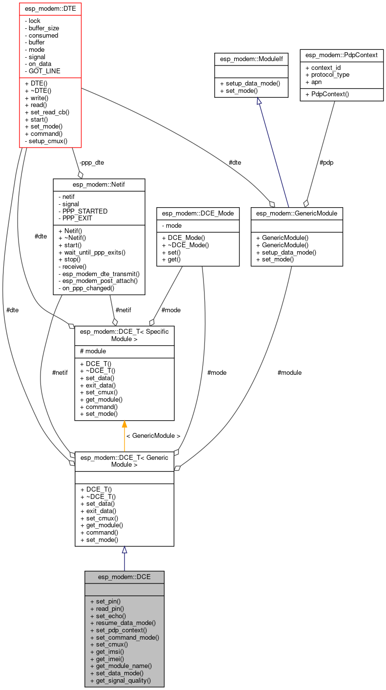

# Internal design

## Design decisions

* Use C++ with additional C API

* Use exceptions
  - Use macro wrapper over `try-catch` blocks when exceptions off (use `abort()` if `THROW()`) 

* Initializes and allocates in the constructor (might throw)
  - easier code with exceptions ON, with exceptions OFF alloc/init failures are not treated as runtime error (program aborts)
  - break down long initialization in constructor into more private methods

* Implements different devices using inheritance from `GenericModule`, which is the most general implementation of a common modem
  - Internally uses templates with device specialization (modeled as `DCE<SpecificModule>`) which could be used as well for some special cases, 
  such as implantation of a minimal device (ModuleIf), add new AT commands (oOnly in compile time), or using the Module with DTE only (no DCE, no Netif) for sending AT commands without network
  
## DCE collaboration model

The diagram describes how the DCE class collaborates with DTE, PPP and the device abstraction

## Terminal inheritance

Terminal is a class which can read or write data, and can handle callbacks when data are available. UART specialization
is provided implementing these method using the uart driver.

## CMUX terminal

The below diagram depicts the idea of using CMUX terminal mode using the CMuxInstance class which is a terminal
(it implements the basic read/write methods) interfacing arbitrary number of virtual terminals,
but at the same time it is also composed of CMux class, which consumes the original terminal and uses its read/write methods
to multiplex the terminal.

