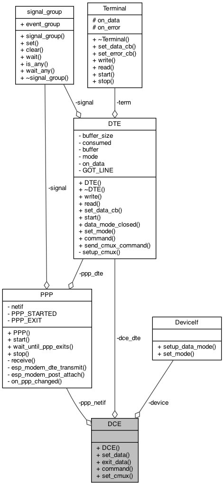
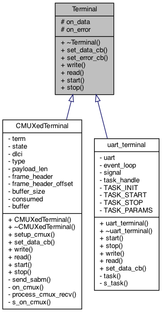
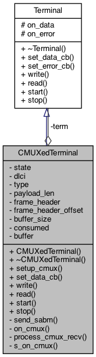

# Internal design

## Design decisions

* Use C++ (lambdas) wit C API
* Use exceptions (implement nothrow? possibly using `assert()`)
* Initializes and allocates in the constructor (might throw) 
* Implements different devices with template specialization
* Specific device abstraction overrides methods, but does not use virtual function dispatch (modeled as `DCE<SpecificModule>`)

## DCE collaboration model

The diagram describes how the DCE class collaborates with DTE, PPP and the device abstraction

## Terminal inheritance

Terminal is a class which can read or write data, and can handle callbacks when data are available. UART specialization
is provided implementing these method using the uart driver.

## CMUX terminal

The below diagram depicts the idea of using CMUX terminal mode using the CMUXedTerminal class which is a terminal
(it implements the basic read/write methods) interfacing arbitrary number of virtual terminals,
but at the same time it is also composed of another terminal, the real terminal, which is multiplexed.

