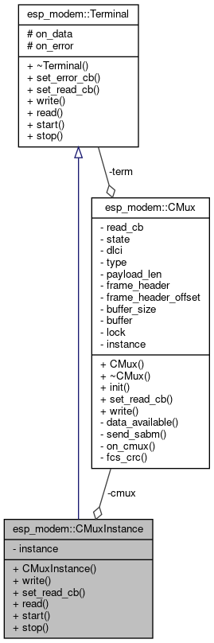

# Internal design

## Design decisions

* Use C++ (lambdas, templates) with additional C API
  
  | esp-modem in C | esp-modem in C++ |
  |----------------|---------------|
```
    +2282
    -3908
```

* Use exceptions (implement nothrow? possibly using `assert()`)

| exceptions off | exceptions on |
|----------------|---------------|
```
Difference is counted as <CURRENT> - <REFERENCE>, i.e. a positive number means that <CURRENT> is larger.
Total sizes of <CURRENT>:                                                 <REFERENCE>     Difference
 DRAM .data size:   10996 bytes                                                 10996
 DRAM .bss  size:   12552 bytes                                                 12488            +64
Used static DRAM:   23548 bytes ( 157188 available, 13.0% used)                 23484            +64 (    -64 available,      +0 total)
Used static IRAM:   54145 bytes (  76927 available, 41.3% used)                 54093            +52 (    -52 available,      +0 total)
      Flash code:  603979 bytes                                                595551          +8428
    Flash rodata:  187772 bytes                                                177852          +9920
Total image size:~ 869444 bytes (.bin may be padded larger)                    850980         +18464
```
| exceptions on | RTTI on |
|----------------|---------------|
```
Total sizes of <CURRENT>:                                                 <REFERENCE>     Difference
 DRAM .data size:   10996 bytes                                                 10996
 DRAM .bss  size:   12552 bytes                                                 12552
Used static DRAM:   23548 bytes ( 157188 available, 13.0% used)                 23548                (     +0 available,      +0 total)
Used static IRAM:   54145 bytes (  76927 available, 41.3% used)                 54145                (     +0 available,      +0 total)
      Flash code:  605331 bytes                                                603979          +1352
    Flash rodata:  196788 bytes                                                187772          +9016
Total image size:~ 879812 bytes (.bin may be padded larger)                    869444         +10368
```
* Initializes and allocates in the constructor (might throw)
  - easier code with exceptions ON, with exceptions OFF alloc/init failures are not treated as runtime error (program aborts)
* Implements different devices with template specialization
  - Specific device abstraction overrides methods, but does not use virtual function dispatch (modeled as `DCE<SpecificModule>`)
  - Use cases: Implement a minimal device (ModuleIf), add new AT commands (oOnly in compile time).
  - Possibly use Module with DTE only (no DCE, no Netif) for sending AT commands without network
  
Example:
```
class SIM7600: public GenericModule {
    using GenericModule::GenericModule;
public:
    command_result get_module_name(std::string& name); // overrides, but is no virtual
};
```
method `get_module_name()` reimplements the *same* method in `GenericModule`

## DCE collaboration model

The diagram describes how the DCE class collaborates with DTE, PPP and the device abstraction


## Terminal inheritance

Terminal is a class which can read or write data, and can handle callbacks when data are available. UART specialization
is provided implementing these method using the uart driver.


## CMUX terminal

The below diagram depicts the idea of using CMUX terminal mode using the CMUXedTerminal class which is a terminal
(it implements the basic read/write methods) interfacing arbitrary number of virtual terminals,
but at the same time it is also composed of another terminal, the real terminal, which is multiplexed.


